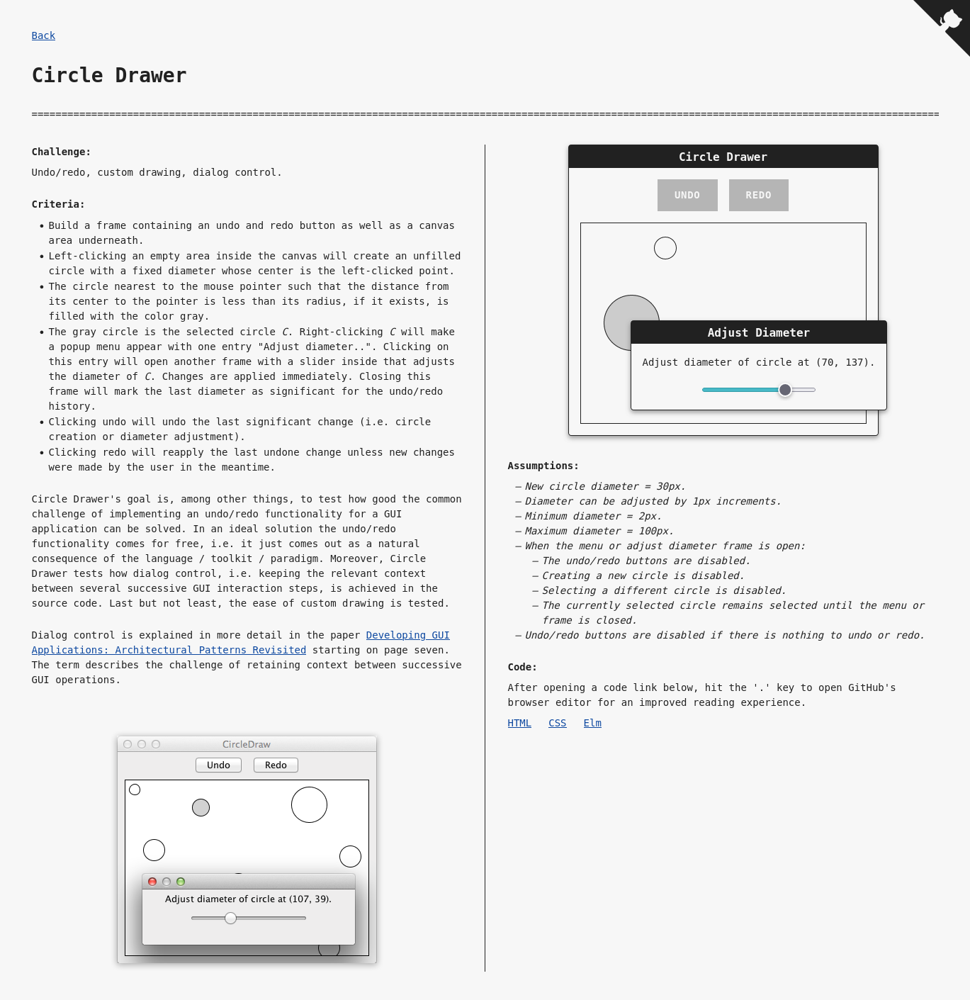

# 7GUIs in Elm - [Use App](https://dwayne.github.io/elm-7guis)

[7GUIs](https://eugenkiss.github.io/7guis/) (7 Graphical User Interfaces) is a GUI programming challenge and [Elm](https://elm-lang.org/) is a functional programming language for building web applications.

> Elm is well-suited for **UI development** and **domain modeling** as is illustrated by the implementations of the [Circle Drawer](#circle-drawer) and [Cells](#cells) tasks.

## [Counter](https://dwayne.github.io/elm-7guis/counter.html)

## [Temperature Converter](https://dwayne.github.io/elm-7guis/temperature-converter.html)

## [Flight Booker](https://dwayne.github.io/elm-7guis/flight-booker.html)

## [Timer](https://dwayne.github.io/elm-7guis/timer.html)

## [CRUD](https://dwayne.github.io/elm-7guis/crud.html)

## [Circle Drawer](https://dwayne.github.io/elm-7guis/circle-drawer.html)

## [Cells](https://dwayne.github.io/elm-7guis/cells.html)

## Credits

- The designs have been adapted from [7GUIs by Brad Woods](https://7guis.bradwoods.io/).
